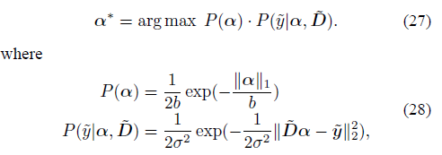
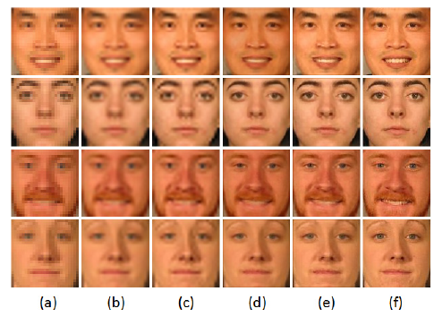

# cqupt-it-homework
重庆邮电大学-计算机科学与技术专业-作业集

[toc]

# 01_算法分析与设计

> 大作业内容为选取一篇有关计算机视觉的文章进行阅读学习，最终上交报告与PPT。

说实话，真给我整不会了，第一次读酱紫专业的论文。看着下面这些东西就发愣。

后边就磕磕绊绊的读完了，边查边脑部。虽然最后还是每读懂，但是我知道这个算法确实强。

(从左到右，人脸越来越清晰

